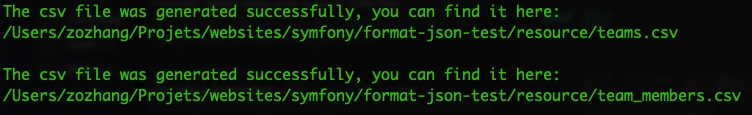

# Format JSON Data to CSV
This is a multi-dimensional JSON data conversion based on Symfony, using [ParseCsv](parsecsv) class to export csv file.

[parsecsv]: http://en.wikipedia.org/wiki/Comma-separated_values

## Requirements
| Title | Version |
|----------------------|------------------|
| PHP      | \>=7.2.5  |
| Composer | \^2.0.13  |
| Symfony  | \^5.4.3   |
| ParseCsv | \^1.3.2   |

## Installation

### Git
You can use the following git command to clone the code locally.
```
git clone git@github.com:ZoZhang/format-json-test.git
```
Then enter the root directory of program and enter the following command to complete the code dependency file.
```
composer install
```

### Docker
If you use docker then you just need to enter the following command
```
docker pull zozhang/format_json_test
```

## Utilisation
If you use docker, you need to enter the docker container with the following command before the next step

```
docker run -it -d --name format_json_test zozhang/format_json_test

docker exec -it format_json_test sh

cd /var/www/html/format-json-test-1.0
```

Next step, you can enter the following command to view the result

```
php bin/console app:export-csv
```

If all goes well, you will get 2 csv files in the `resource` directory, and get a message similar to the following:


